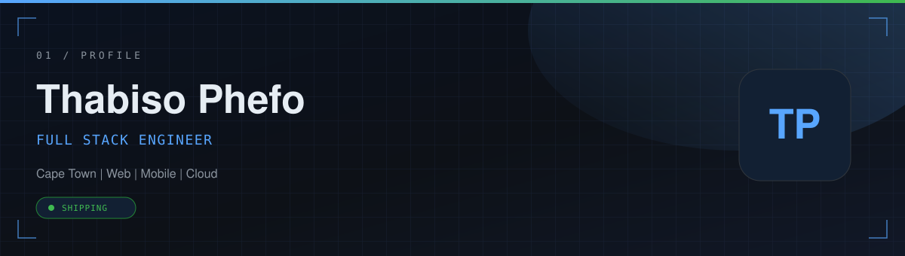
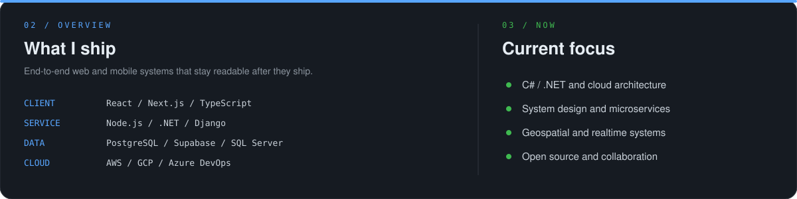
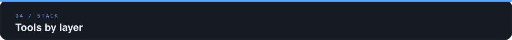
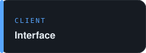
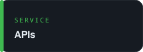
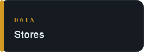
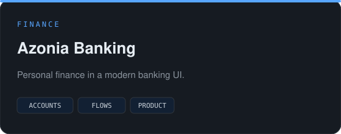
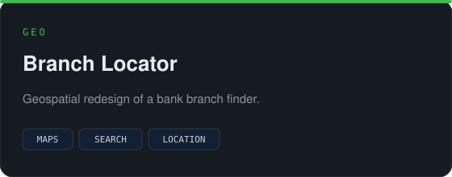
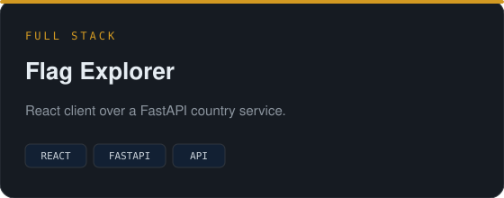
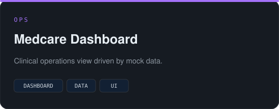

  

<table>
  <tr>
    <td width="50%" valign="top">
      
    </td>
    <td width="50%" valign="top">
      
    </td>
  </tr>
</table>

  

  

  

  

<table>
  <tr>
    <td width="22%" valign="middle">
      
    </td>
    <td valign="middle">
      
    </td>
  </tr>
  <tr>
    <td width="22%" valign="middle">
      
    </td>
    <td valign="middle">
      
    </td>
  </tr>
  <tr>
    <td width="22%" valign="middle">
      
    </td>
    <td valign="middle">
      
    </td>
  </tr>
  <tr>
    <td width="22%" valign="middle">
      
    </td>
    <td valign="middle">
      
    </td>
  </tr>
</table>

  

## Systems

<table>
  <tr>
    <td width="50%" valign="top">
      
    </td>
    <td width="50%" valign="top">
      
    </td>
  </tr>
  <tr>
    <td width="50%" valign="top">
      
    </td>
    <td width="50%" valign="top">
      
    </td>
  </tr>
</table>
